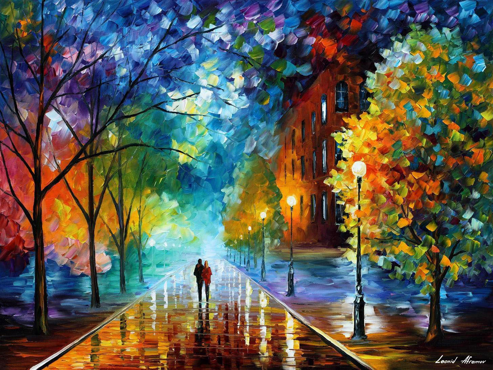
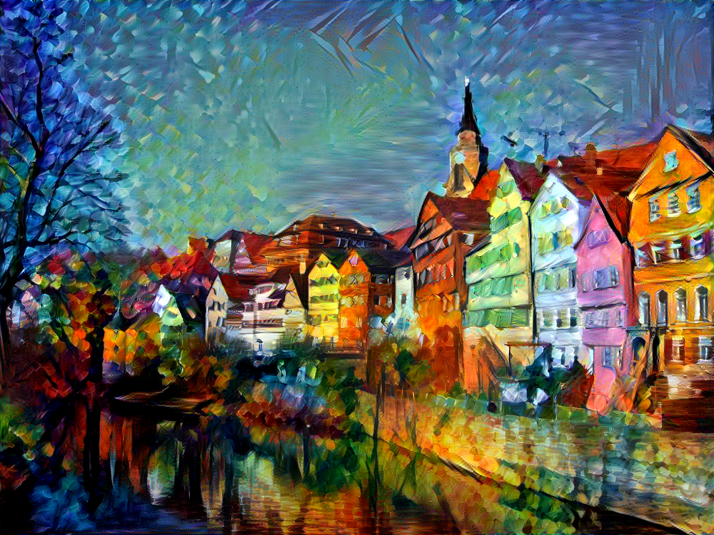

# Deep_Style_Transfer
This application is developed by PyQt5

## Usage
* run command `python callGUI.py` in windows cmd or powershell
## Note
* The .exe application is biger than 100MB, so if you want the exe application ,you can leave your email in issues page,or you can generate .exe application with [Pyinstaller](https://github.com/pyinstaller/pyinstaller).
* Before using this application ,you have to download the [VGG-19 model weights](http://www.vlfeat.org/matconvnet/pretrained/),after downloading, copy the weights file `imagenet-vgg-verydeep-19.mat` to the project directory.
* If you want to use lbfgs algotithm ,you should download the lbfgs.py to overide the lbfgs.py in your scipy\optimize,because i has changed the source code in scipy\optimize\lbfgs.py so that the app can plot the convergence cureve of loss function in every iteration

## GUI Display

## Example
* left is style image and right is content image

* result img

