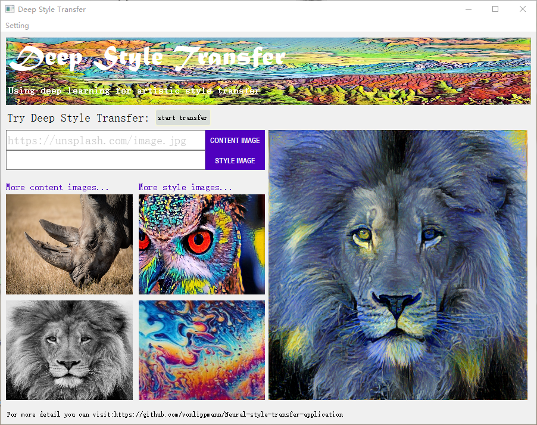

# Deep-_Style_Transfer
This application is developed by PyQt5
## Note
* The .exe application is biger than 100MB, so if you want the exe application ,you can leave your email in issues page. After i finished the contruction of my webside ,i will put all the source on there ,and show the web address here.
* Before using this application ,you have to download the [VGG-19 model weights](http://www.vlfeat.org/matconvnet/pretrained/)
* After downloading, copy the weights file `imagenet-vgg-verydeep-19.mat` to the project directory.
* If you want to use lbfgs algotithm ,you should download the lbfgs.py to overide the lbfgs.py in your scipy\optimize,because i have to plot the loss function in every iteration ,so i has changed the source code in scipy\optimize\lbfgs.py
* Although the app offer GPU device to calculate , but actually it can not use GPU as the tensorflow is not the GPU version. If you want to use GPU version , you could run the source code in CMD by inputting 'python callGUI.py'. But the preconditon is that you installed the tensorflow-gpu and configurated it successfully.
## GUI Display

